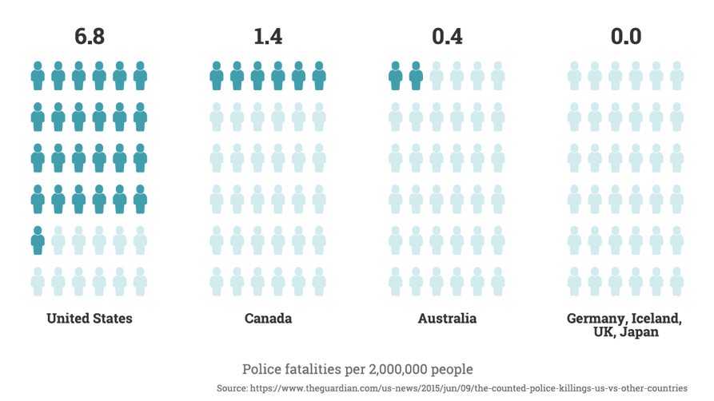
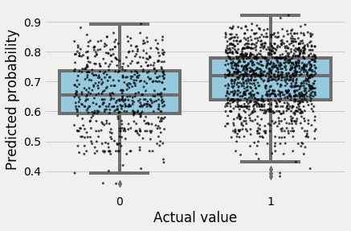

# Assessing Measures to Decrease Fatalities from Police Shootings
Author: Katie Wetstone, Master of Development Practice candidate at the University of California, Berkeley
Date: May 2019
Final Project for Principles & Techniques of Data Science (COMPSCI C200A)

## Introduction

Over one thousand people in the United States were killed by police in 2016.1 While it is difficult to obtain comprehensive, standardized data, estimates show that the rate of police killings in the US dwarfs that in other high-income countries.2

In addition to presenting a public health issue, police-related fatalities disproportionately affect communities of color and deepen racial inequality.3 Generally, tactics to decrease police fatalities fall into two buckets:
1.	<b>Police training</b>: Analysis by Campaign Zero found that police departments with limits on police use of force killed substantially fewer people.4
2.	<b>Gun control</b>: The prevalence of gun ownership is often credited for the gap between killings in the US and in other high-income countries.5 

#### <i>Research Question:</i> Can state-level legislation regarding police training and gun control reduce the fatality rate of police-civilian interactions?
My research seeks to determine whether any state-level legislation has a significant impact on reducing police killings and, if so, which are the most impactful. The goal is to enable state legislators to either promote the most effective state-level policies or, if there are none, to advocate more strongly for federal action.

### Dataset
The research relies on a crowd-sourced database of police killings dating back to 2014.6 The dataset includes information on each victim’s age, gender, race, location, whether or not they were armed, whether or not they were killed, and a short summary of the circumstances. 

I created a csv with compiled state-level data on police training and gun control by drawing from a variety of sources, which are credited in the `states_README` dataframe shown when the dataset is imported in the EDA section.

### Methodology
I use a logistic regression to predict whether or not a victim was killed based on state- and individual-level features. Individual characteristics include race, gender, and aspects of the circumstances generated by performing text analysis on the incident summaries.

The significance of each feature is assessed based on the bootstrapped distribution of its coefficient. A feature is  considered significant if the 95% confidence interval does not include zero.

## Conclusion

### Logistic regression results
The distribution of values for the coefficients of the variables tested (based on bootstrapping) is shown below.

Of these, 9 are significant (ie. 0 is not within the 95% confidence interval). 
According to the model, a civilian is less likely to be killed if they are unarmed (`unarmed`), if the violent crime rate in the state is higher (`log_crime`), and if the state mandates medical training for policer officers (`medic_train`).
A civilian is more likely to be killed if mental health plays a role in the incident (`mh`), if the officer attempts to use deescalation techniques (`deesc`), if the income in the state is higher (`log_income`), and if the victim's race is recorded by the officer (`Black`, `White`, and `hisplat`).

While individual coefficients may be significant, the best model based on the data available is still a very poor predictor of fatality.  
- Precision: 0.705
- Recall: 0.979
- False-alarm rate: 0.919
- Accuracy: 0.702

The very high false-alarm rate indicates that the model does not do a good job of identifying the relatively rare cases in the dataset in which someone is not killed. The high accuracy and recall are misleading as to the model's effectiveness because they reflect the class imbalance in the data more so than the model's performance. As shown below, the distribution of probabilities predicted does differ for those that were not killed v. those that were, but not by enough to provide meaningful predictions.

### Limitations

A strong limitation of the dataset is selection bias. The crowd-sourced data collected skews heavily towards violent incidents - in most of them, officers at least attempted to shoot a victim. Among these incidents, whether or not a civilian died is much more likely to depend on chance. 
There is an overwhelming lack of systematically collected data regarding police-civilian interactions. More recent efforts by <a href="https://www.theguardian.com/us-news/ng-interactive/2015/jun/01/the-counted-map-us-police-killings">The Guardian</a> and <a href="https://www.washingtonpost.com/graphics/2019/national/police-shootings-2019/?utm_term=.2c8eb8862b88">The Washington Post</a> have made progress in consolidating data, but still focus primarily only on incidents in which violent confrontation occurred.

Additionally, the vast majority of data points are drawn from 2014. Information about exactly when state-level laws were implemented is not clear. It is possible that the outcomes in my dataset did not have time to respond to state-level legislation, and are therefore unable to answer the research question.

### Recommendations

1.	<b>Better data:</b> More data on police-civilian interactions should be systematically tracked and released so that a better model can be created to inform funding and legislation efforts. This data should:
    - <b>Include a wider range of incidents:</b> The predictable determining factors of fatality likely occur before an officer begins shooting at a victim. Therefore the data must include incidents with a much wider variety of outcomes—including de-escalation—and not just those that ended in violence.
    - <b>Be up-to-date:</b> Many state-level actions have been taken recently, and multi-year old data is unlikely to reflect those changes. Data should be collected and made publicly available more promptly.

2. <b>Add interaction effects:</b> With complex social determinants like race and gender, there are likely to be strong interactions effects between variables. It is difficult to account for all of these in a regression because each interaction  has to be specified in the equation to be tested. Once better data is availabe, a machine learning method such as a boosted regression tree would better handle the complex higher-order interactions likely in play.

 
 
    1 "The Counted." <i>The Guardian</i>. Updated 2016. <a href="https://www.theguardian.com/us-news/ng-interactive/2015/jun/01/the-counted-police-killings-us-database">link</a>
 2 Lartey, Jamiles. "By the numbers: US police kill more in days than other countries do in years." <i>The Guardian.</i> 9 June 2015. <a href="https://www.theguardian.com/us-news/2015/jun/09/the-counted-police-killings-us-vs-other-countries">link</a>
 3 Lopez, German. "There are huge racial disparities in how US police use force." <i>Vox.</i> 14 Nov 2018. <a href="https://www.vox.com/identities/2016/8/13/17938186/police-shootings-killings-racism-racial-disparities">link</a>
 4 Police Use of Force Project. "Policy Database." <a href="http://useofforceproject.org/#project">link</a>
     5 Lopez, German. "America's gun problem, explained." <i>Vox.</i> 14 Feb 2019. <a href="https://www.vox.com/2015/10/3/9444417/gun-violence-united-states-america">link</a>
 6https://docs.google.com/spreadsheets/d/1cEGQ3eAFKpFBVq1k2mZIy5mBPxC6nBTJHzuSWtZQSVw/edit#gid=1144428085

